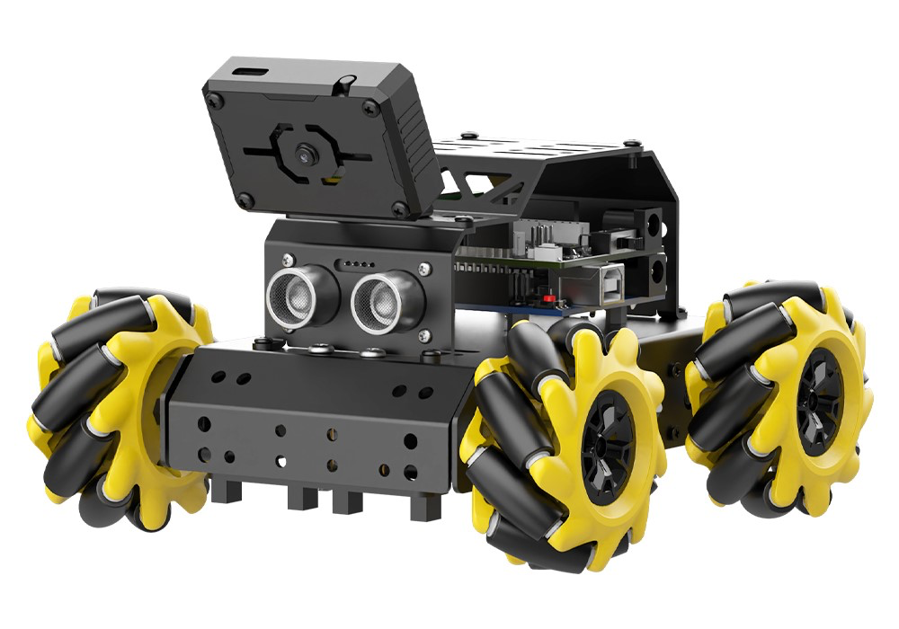
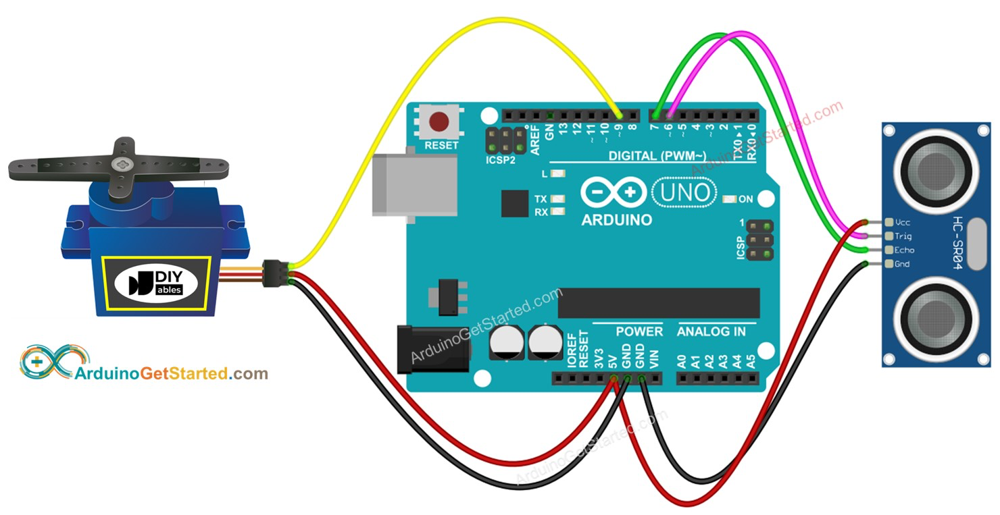

I wanted to get an idea of what technologies my project would require, so I looked on YouTube for projects similar to mine.   

These two videos were really helpful for me to understand the general layout of the rover.

The rover will have four Mecanum wheels connected to four motors that are glued under a flat rectangle chassis. Motor drivers and an Arduino Uno/Mega are to be fastened to the top of the rectangular chassis. A bluetooth module (such as HC-05 Bluetooth module) will be connected as well to allow commands wirelessly. The back of the chassis will hold batteries (battery type to be determined).

On the second story of the chassis, a servo motor will also be attached to the front of the chassis with a small bracket fused to its top. The bracket will hold the ultrasonic sensor. Additionally, a small camera will be installed in front of the chassis on the second story as well. Because I only have 5ghz wifi, I'll have to connect the camera to a Raspberry Pi Zero 2W (to be on the first story) so that I can get live footage from it and migrate controls to the Raspberry Pi as well.

I decided to have the electronics on the first story and sensors/mop on the second. This protects the electronics from any water that could fall from the mophead as it moves around.

The next challenge is the mop installation. A circular mop/scrub pad will be mounted on a DC motor, and that fixture will be mounted on a hinge so that the robot can put away the mop head whenever needed. The hinge will be moved by a servo motor (SG90 servo motor). The mophead will have some sort of connection that allows it to be facing downwards as the hinge changes angles. A small tray filled with solution will be mounted on the back of the second story with a mini basket in it with holes that allows the solution from the tray to float in it. The hinge has the ability to fully rotate the mop from the ground up into the small tray to submerge the mophead in water. The mophead will also spin here to clean itself.

3D printed parts would include the double story chassis with mounts for motors, electronics, and for the small tray. The second story will have the ability to be added to and removed from the first story for easy electronic installation. The first story will have 4 walls around it, and holes will be designed for each so that wires can connect unobstructed. Other things to print include the mount for the mophead and the hinge, the mini tray with built in basket, bracket for ultrasonic sensors, bracket for camera, and a battery pack cover (TBD).

The hinge type for the mophead to stay parrallel to the ground at all times is still TBD.

Hardware includes:

1. 4 mecanum wheels
2. 4 DC Motors (big for wheels)
3. 1 DC motor (small for mophead)
4. HC-SR04 ultrasonic sensor
5. Arduino Uno
6. Motor Driver Shield
7. Rasberry Pi Zero 2 W
8. Wide-lens camera module (for the Pi)
9. HC-05 Bluetooth module
10. Standard SG90 servo motor (for hinge)
11. Micro servo motor for (ultrasonic sensor)
12. Small circular mophead/scrub pad
13. Wires
14. Battery pack (which one?)
15. Transistor for power?

Inspiration:

