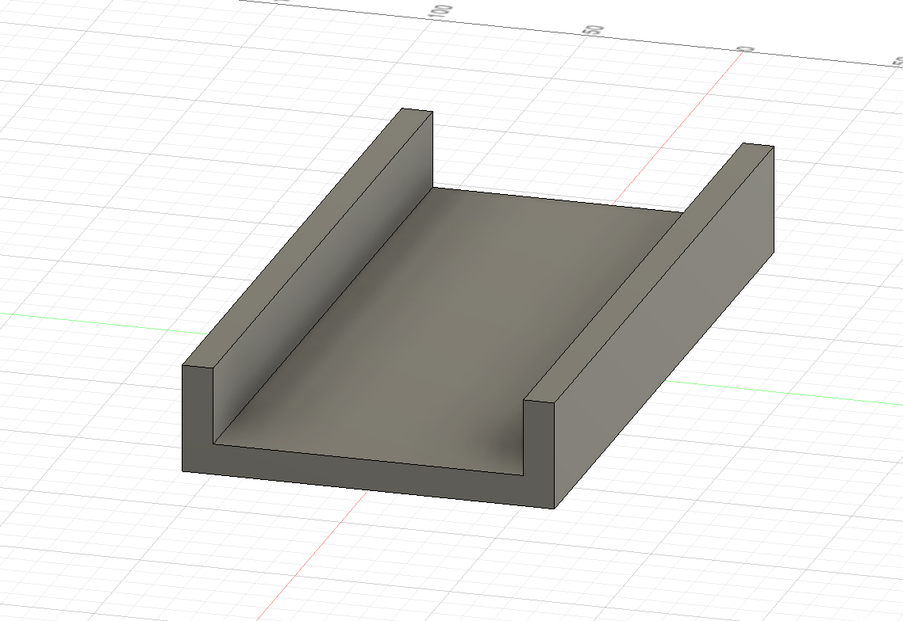
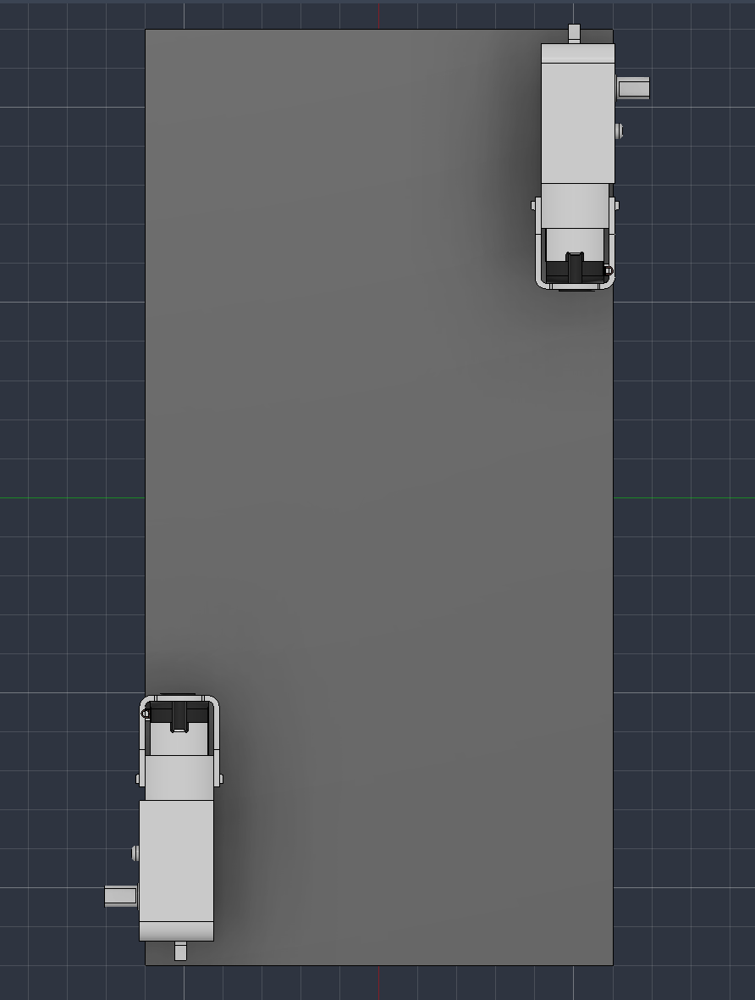
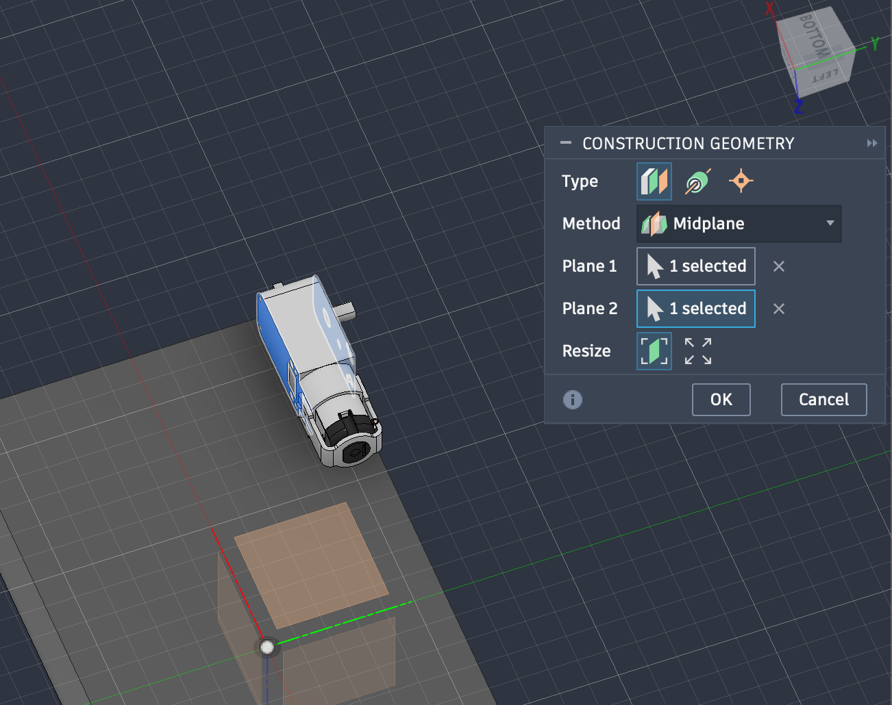
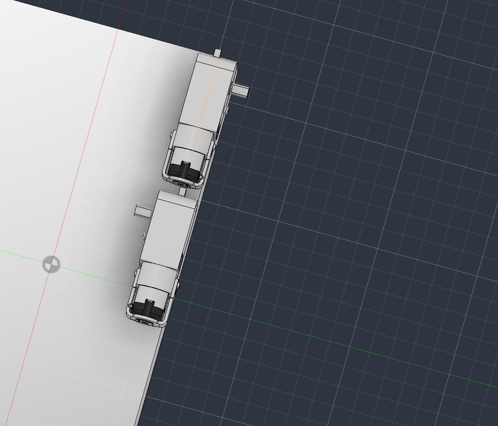
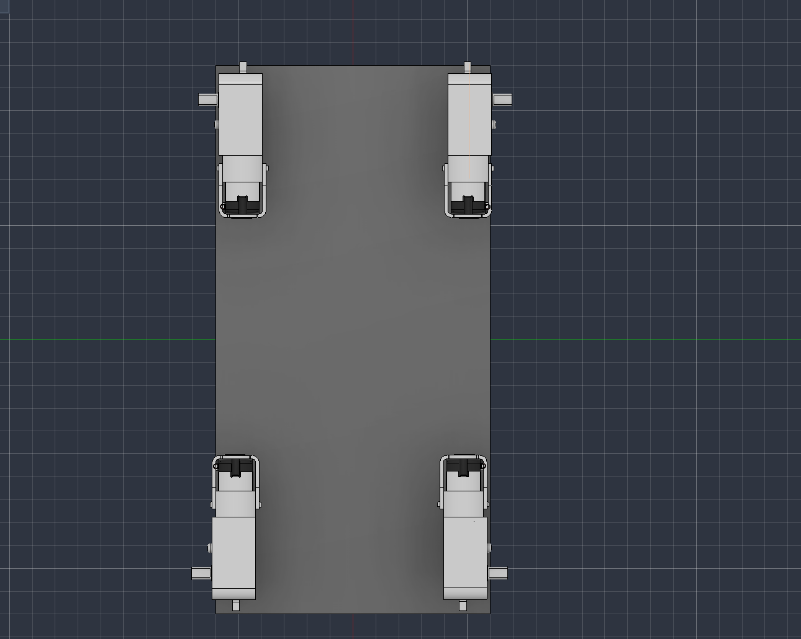

Alright, today I am going to start with importing the motors and other parts into Fusion 360 to create the mockup.

First, I need to finalize what batteries I'll use.

Based on the power that the machine would use on average (for moving around, running camera, and for the mop), I'll go with a dual battery setup.

For the Arduino and Raspberry Pi (the electronics), I'll use a USB battery pack. It'll plug directly into the Raspberry Pi, which can relay the energy to the Arduino.

For the motors, I'll use a 7.2V NiMH RC Battery Pack because the mophead and movement will consume a lot of energy.

To control power to the mophead, I'll use a MOSFET transistor module that will connect to the NiMH battery pack and Arduino.

Also, I found out that the Raspberry Pi Zero 2 W doesn't support 5GHz network, which is disappointing. Instead, I'll use the Raspberry Pi 3 Model A+. For the motor driver, I'll use the Adafruit Motor Shield V2.

For the camera, I'll need a Pi Zero Camera Cable Adapter because the Raspberry Pi 3 Model A+ is compact so it doesn't fit natively with standard Raspberry Pi camera cables.

To be on the safe side for powering the hinge, I'll use the EMAX ES3054 servo.

The motors for the wheels are TT Motors.

Updated BOM:

1. 4 mecanum wheels
2. 4 1:220 TT Motors (big for wheels)
3. 1 DC motor (small for mophead)
4. HC-SR04 ultrasonic sensor
5. Arduino Uno
6. Adafruit Motor Shield V2 motor driver
7. Raspberry Pi 3 Model A+
8. Pi Zero Camera Cable Adapter
9. Wide-lens camera module (for the Pi)
10. HC-05 Bluetooth module
11. Standard EMAX ES3054 (for hinge)
12. SG90 servo motor (for ultrasonic sensor)
13. Small circular mophead/scrub pad
14. Wires
15. USB battery pack
16. 7.2V NiMH RC Battery Pack
17. MOSFET transistor module

Now that it's updated, I will import the motor and mecanum wheels into fusion 360 first.

Actually I should choose the motor from Aliexpress first. I see there's 1:48, 1:120, and 1:220 options. What do these mean?

It seems to be speed and torque ratios, with 1:48 being highest speed but lowest torque, while 1:220 being lowest speed and highest torque.

I'll use 1:220 because of the sheer amount of things the rover has to move. ([https://www.aliexpress.us/item/3256808093084021.html](https://www.aliexpress.us/item/3256808093084021.html))

I found the model on Grabcad, but it's not downloading for some reason. I tried a different browser and the same issue persists. Oh, the problem was with the VPN.

I made the chassis for the first story of the rover.

I ran into my first problem. When mounting the motors to the chassis, I realized since they were one sided, the same motor model couldn't be used for all 4 corners. I'll see if I can use the mirror tool successfully to create a mirrored version.

I'm using the midplane tool to create a plan to mirror across.

It worked! Now I can arrange all four motors.

All four motors have been mounted!

Tomorrow I'll add the wheels and the electronic boards.
