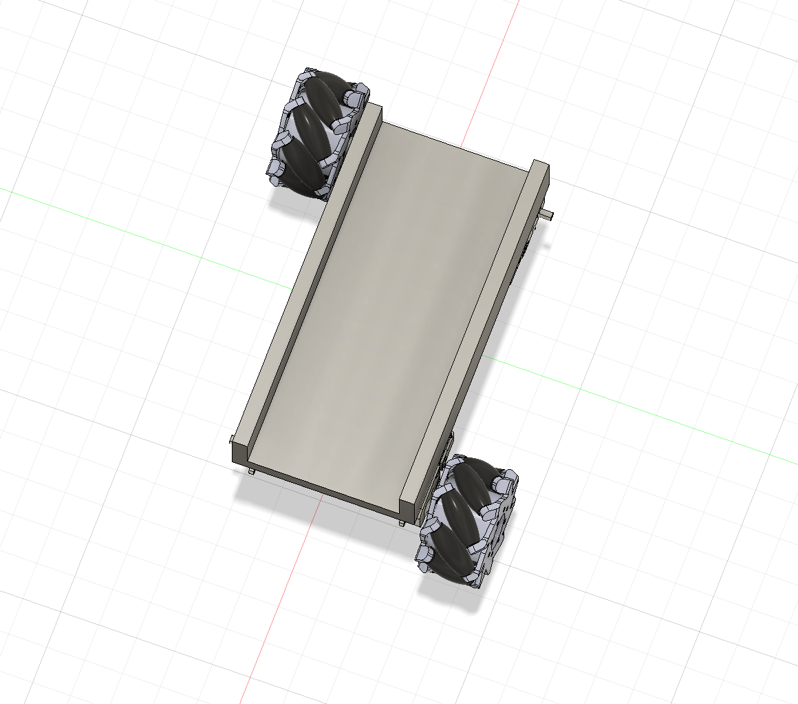
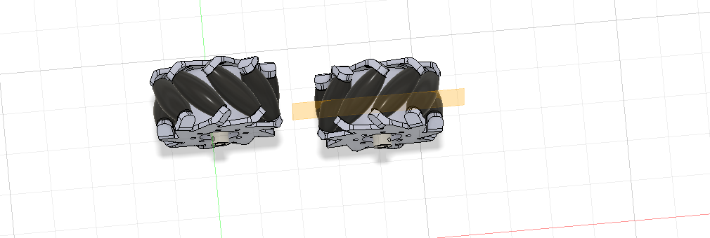
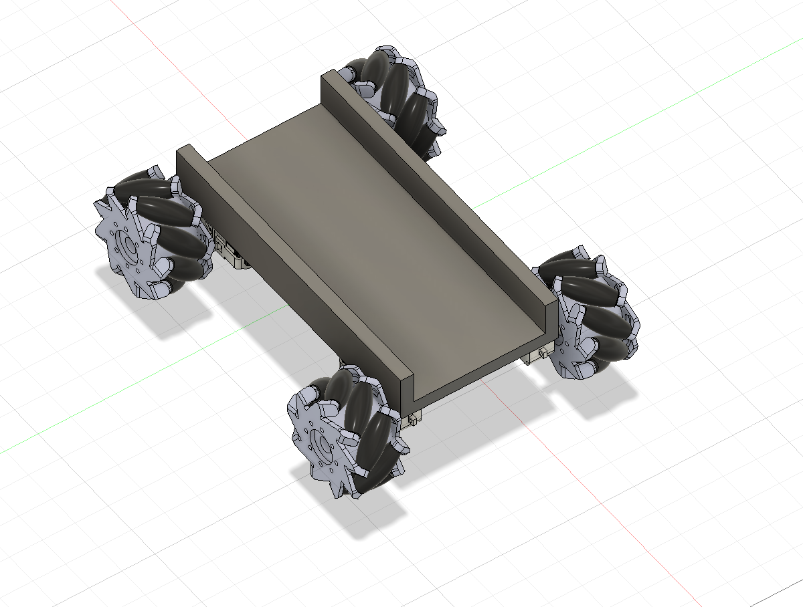
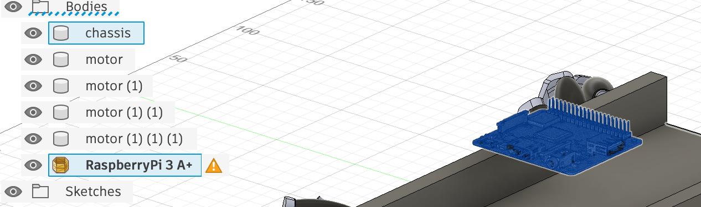
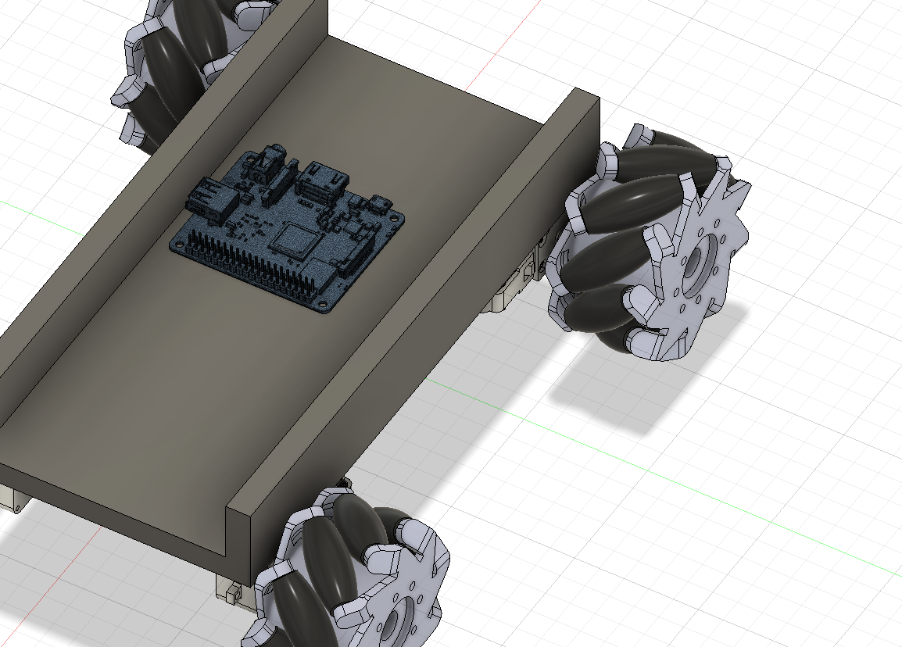
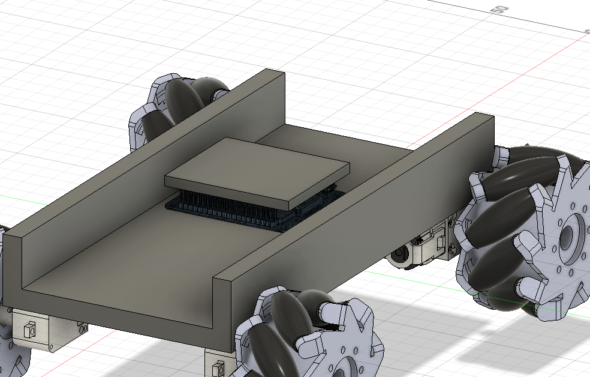

I'm going to begin with adding the Mecanum wheels. I didn't choose what size wheels to get yet, so I'll decide that now. The link will be [https://www.aliexpress.us/item/3256804929248374.html](https://www.aliexpress.us/item/3256804929248374.html)

I'll get the biggest size (80 mm). I want to confirm that these wheels will go directly on the motors without needing additional pieces. It seems like they should.

Found a model of that and uploaded it into fusion. ([https://grabcad.com/library/mecanum-wheel-116](https://grabcad.com/library/mecanum-wheel-116))

Okay so we got two wheels mounted but it's the same issue as before: they're both one sided. Mecanum wheels need to be facing different directions (so when viewed from above the rollers form an X shape. I'll have to do the same mirror thing that I did to the motors.

Mirror was a success! Notice how both wheels are pointing the same way but their rollers are opposite directions! (Mirror is my favorite tool)

All wheels have been mounted. Now onto electronics.

First I want to look for a minute at the raspberry pi and the arduino. Do I really need both? I don't think so. Actually, I could run everything off of a Rasberry Pi. This would simplify my BOM, reduce costs, and be more efficient for the case.

I can drop the bluetooth, the arduino, and other things. The motor driver will need to change to be compatible with the Raspberry. The ultrasonic sensor will still work (using [https://www.aliexpress.us/item/3256812540803651.html](https://www.aliexpress.us/item/3256812540803651.html)) because it is compatible with 3.3v of the raspberry.

I found this motor driver [https://www.aliexpress.us/item/3256807075492551.html](https://www.aliexpress.us/item/3256807075492551.html) (It's cheaper on their site [https://www.dfrobot.com/product-2851.html](https://www.dfrobot.com/product-2851.html)) but idk about the shipping.

It has its own power regulator, so I will only need one power bank! The materials has simplified a lot lol.

Here's the updated BOM:

1. 4 80mm mecanum wheels
2. 4 1:220 TT Motors (big for wheels)
3. 1 DC motor (small for mophead)
4. MOSFET transistor module for the small DC
5. HC-SR04P ultrasonic sensor (must be 3.3v compatible)
6. Raspberry Pi 3 Model A+
7. DF Robot Motor Driver Expansion Board
8. Pi Zero Camera Cable Adapter
9. Wide-lens camera module (for the small form factor Pi)
10. Standard EMAX ES3054 (for hinge)
11. SG90 servo motor (for ultrasonic sensor)
12. Small circular mophead/scrub pad
13. Wires
14. 7.2V NiMH RC Battery Pack
15. 12 mm M2.5 standoffs (spacers) + M2.5 screws

Cool, now let's important that raspberry Pi. ([https://grabcad.com/library/raspberry-pi-model-3-a-1](https://grabcad.com/library/raspberry-pi-model-3-a-1))

Fusion doesn't like the model for some reason and says that it isn't a closed mesh. Hopefully that's not an issue. Fusion crashed while trying to convert it into a body. I hope my work was saved 😭

Ah yes, fusion made a recovery document. Amazing. I don't want this to happen again so I'm going to see if I can enable autosave in fusion. Hmm I can't find the setting, so nvm.

We got it back!

Now for the HAT. I can't find the online model so I'll assemble it myself by following dimensions. (Page for reference: schematic [https://wiki.dfrobot.com/dri0054/#docs](https://wiki.dfrobot.com/dri0054/#docs))

I based the dimensions off of 56x65 mm

Note to buy M2.5 standoffs (spacers) to make sure motor driver is secure to the board.

Okay good progress for today. Tomorrow I'll add the battery pack and servo + ultrasonic thing.
