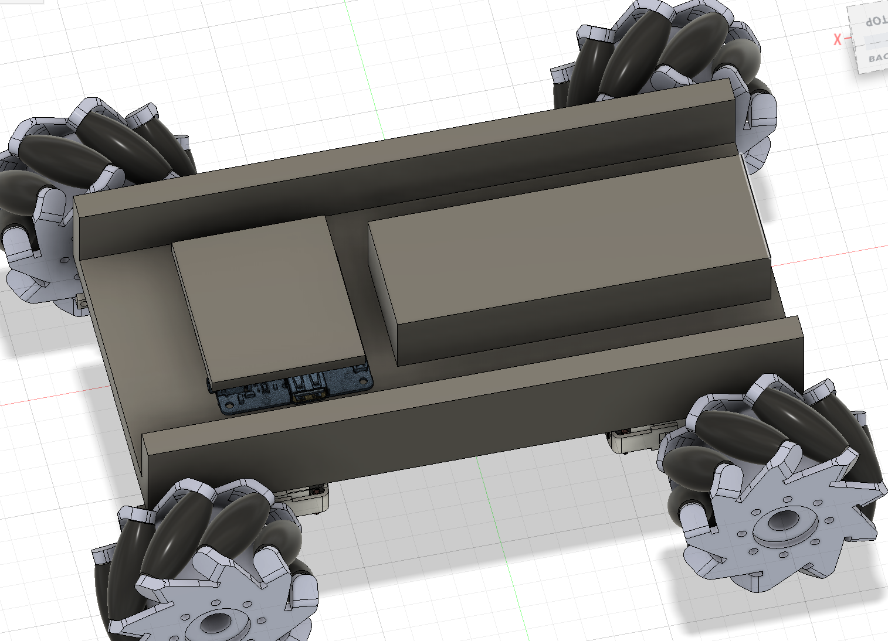
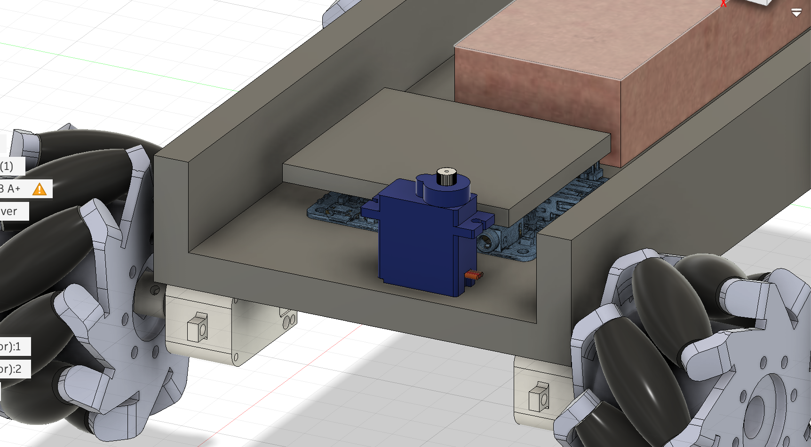
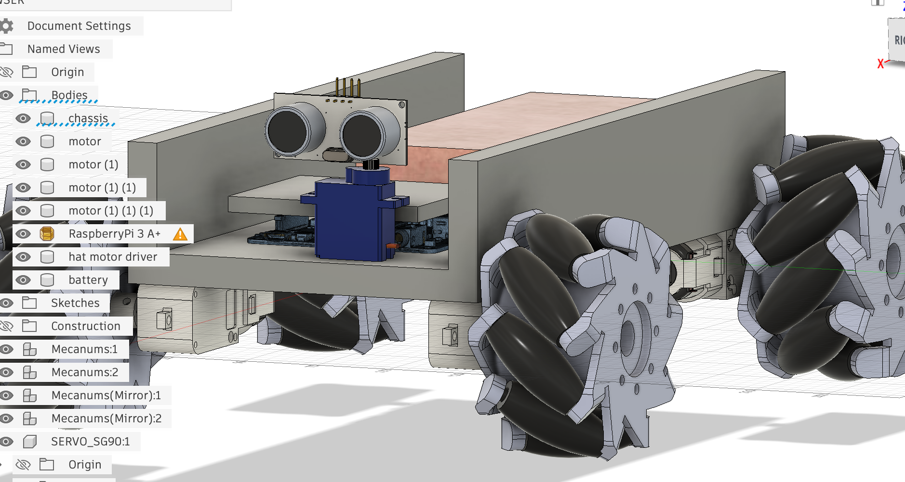
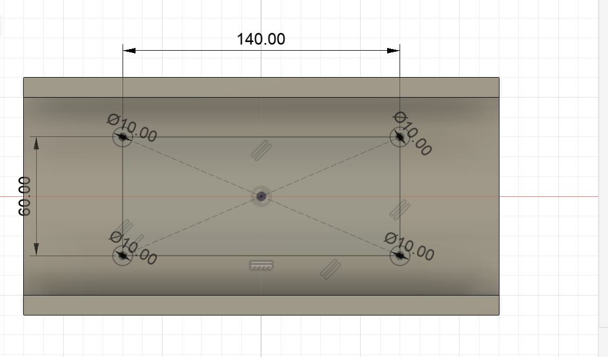
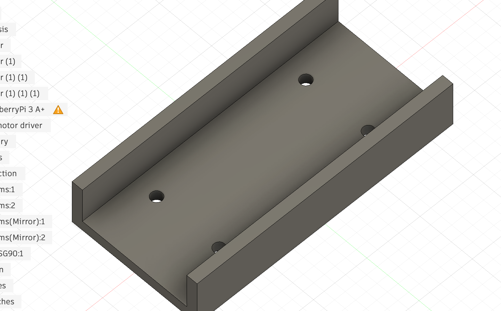
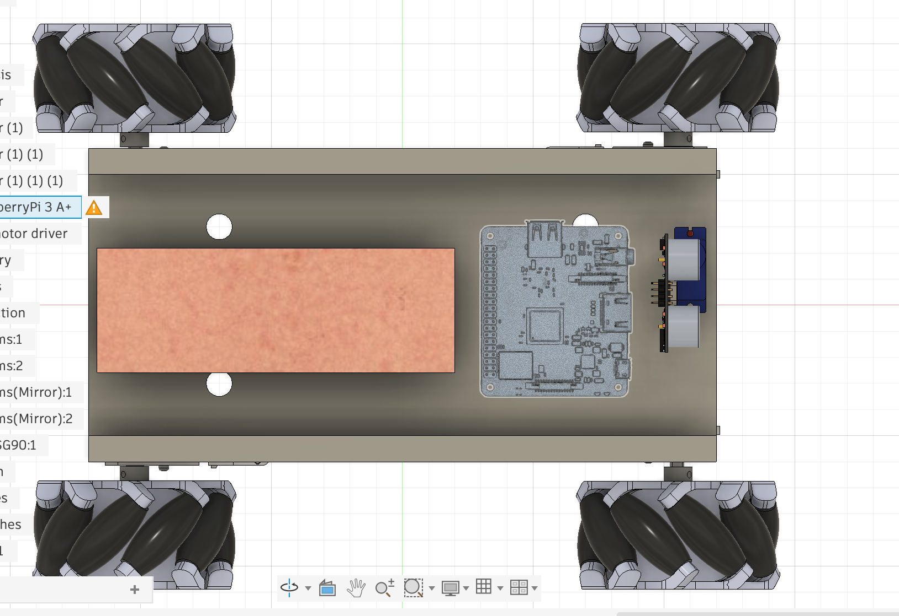
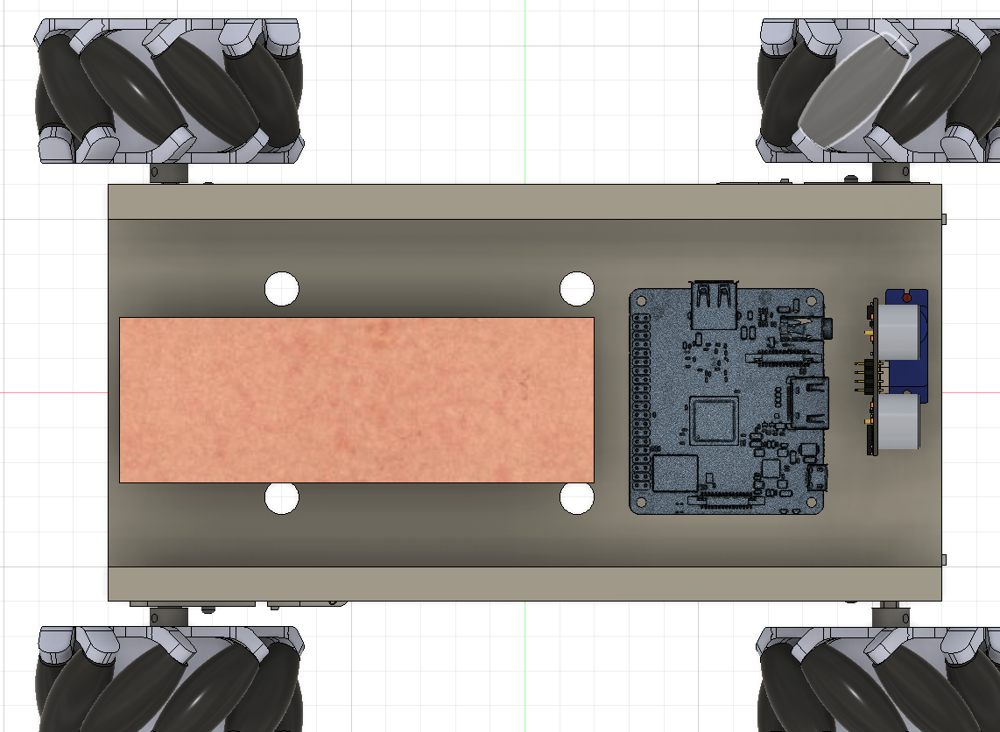

Alright, so I think I start with the battery pack.

I'm not sure if I have to model it or if there's a model available. First, what NiMH battery pack should I use? I already know it should be 7.2V. After looking at battery sizes, I think I will aim for 3000 - 5000 mAH. [https://www.aliexpress.us/item/3256803941139133.html](https://www.aliexpress.us/item/3256803941139133.html) -3500 mAH is great seeming (it has enough reviews for me to trust it). Since it comes with an EU charger, I will add this EU-US adapter:[https://www.aliexpress.us/item/3256807292451852.html](https://www.aliexpress.us/item/3256807292451852.html)

[https://www.aliexpress.us/item/3256806681308594.html ](https://www.aliexpress.us/item/3256806681308594.html)is the thing needed to allow this battery pack to connect to my motor driver.

Updated BOM:

1. 4 80mm mecanum wheels - [https://www.aliexpress.us/item/3256804929248374.html](https://www.aliexpress.us/item/3256804929248374.html)
2. 4 1:220 TT Motors (big for wheels) - [https://www.aliexpress.us/item/3256808093084021.html](https://www.aliexpress.us/item/3256808093084021.html)
3. 1 DC motor (small for mophead) - TBD
4. MOSFET transistor module for the small DC
5. HC-SR04P ultrasonic sensor (must be 3.3v compatible) - [https://www.aliexpress.us/item/3256812540803651.html](https://www.aliexpress.us/item/3256812540803651.html)
6. Raspberry Pi 3 Model A+ - TBD
7. DF Robot Motor Driver Expansion Board - [https://www.aliexpress.us/item/3256807075492551.html](https://www.aliexpress.us/item/3256807075492551.html) or [https://www.dfrobot.com/product-2851.html](https://www.dfrobot.com/product-2851.html)
8. 12 mm M2.5 standoffs (spacers) + M2.5 screws
9. Pi Zero Camera Cable Adapter - TBD
10. Wide-lens camera module (for the small form factor Pi) - TBD
11. Standard EMAX ES3054 (for hinge) - TBD
12. SG90 servo motor (for ultrasonic sensor) - [https://www.aliexpress.us/item/3256806097043668.html](https://www.aliexpress.us/item/3256806097043668.html)
13. Small circular mophead/scrub pad - TBD
14. Wires - TBD
15. 7.2V NiMH RC Battery Pack - [https://www.aliexpress.us/item/3256803941139133.html](https://www.aliexpress.us/item/3256803941139133.html)
16. EU - US Adapter - [https://www.aliexpress.us/item/3256807292451852.html](https://www.aliexpress.us/item/3256807292451852.html)
17. Tamiya Battery Connector - [https://www.aliexpress.us/item/3256806681308594.html](https://www.aliexpress.us/item/3256806681308594.html)

Time to design the battery pack based on dimensions 136.7x47.65x24.44mm.

The big rectangular prism in the back is the battery.

Now that we've done the battery, let's move on to the mini servo + ultrasonic sensor combination. Time to find a mini servo. I found one at [https://www.aliexpress.us/item/3256806097043668.html](https://www.aliexpress.us/item/3256806097043668.html). Let's see if I can find the model. Found [https://grabcad.com/library/micro-servo-sg90-9g-1](https://grabcad.com/library/micro-servo-sg90-9g-1).

Added the servo (the battery pack is now the copperish shade).

Time to import ultrasonic sensor model. ([https://grabcad.com/library/hc-sr04-ultrasonic-sensor-8](https://grabcad.com/library/hc-sr04-ultrasonic-sensor-8))

Okay, got that in there, I also extruded walls by 10mm further to make it taller.

I'm going to add holes in the chassis to allow the wires from the motors at the bottom to thread through.

I first drew the rectangle and added the holes

Now after deleting the rectangle and cutting the holes, here's what it looks like:

Splendid. Now to see how to mount the ulrasonic sensor onto the micro servo.

Actually, two of the holes are in the way of the raspberry pi, so got to fix that:

Fixed!

Going to add mounting holes for the raspberry pi, but got to make sure it's at the right position, so TO DO LATER.

That's it for today. Tomorrow I'll get the sensor on the servo, and that should conclude the first story of the robot chassis (second story is mop mechanism).
