Okay I'm back.

Now to connect ultrasonic sensor to servo. It seems the standard way to mount it is to design a 3d printable piece that screws on top of the servo motor and angles at an L shape to hold the sensor. Lemme verify. Yes correct. The hole is about 1.2mm so I will design a 2.5 mm hole mount.

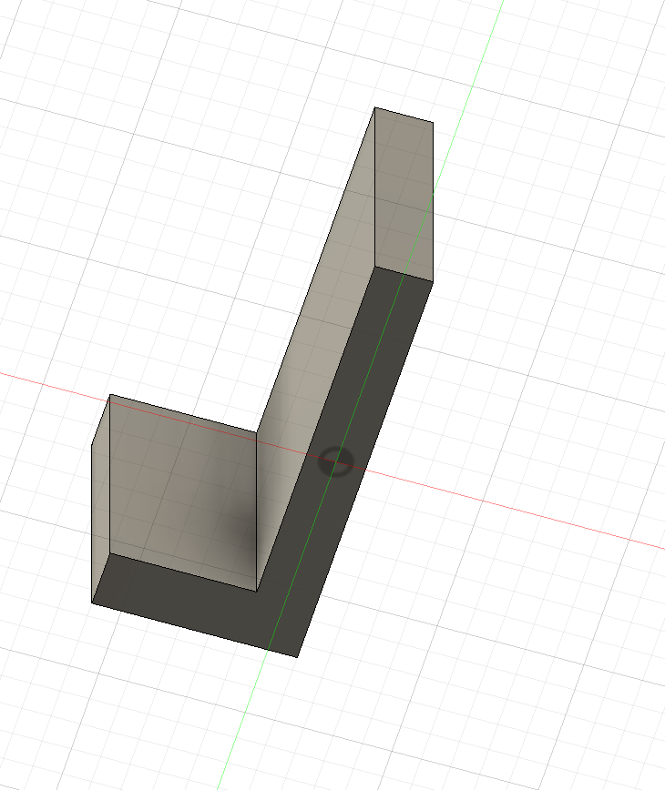

So I have made the mount, now I will put the hole in it.

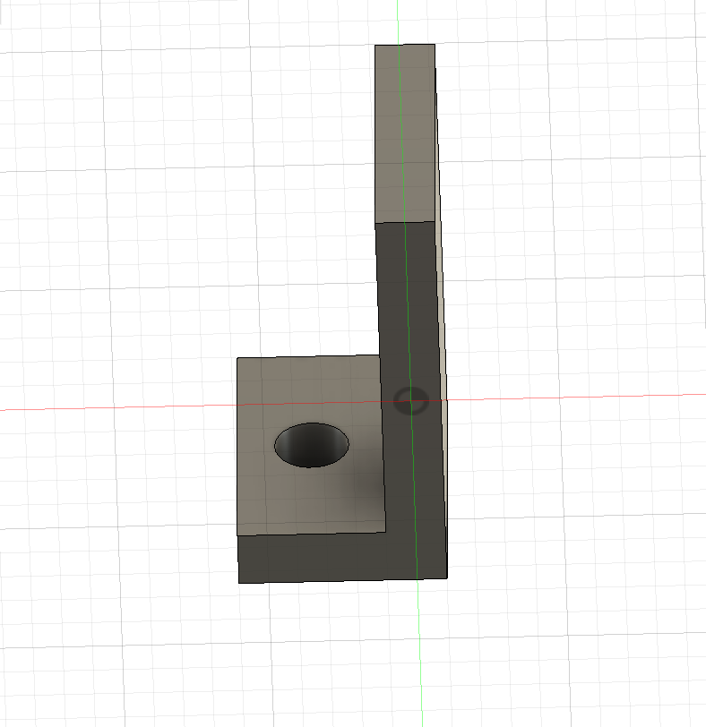

Done, that was pretty easy!

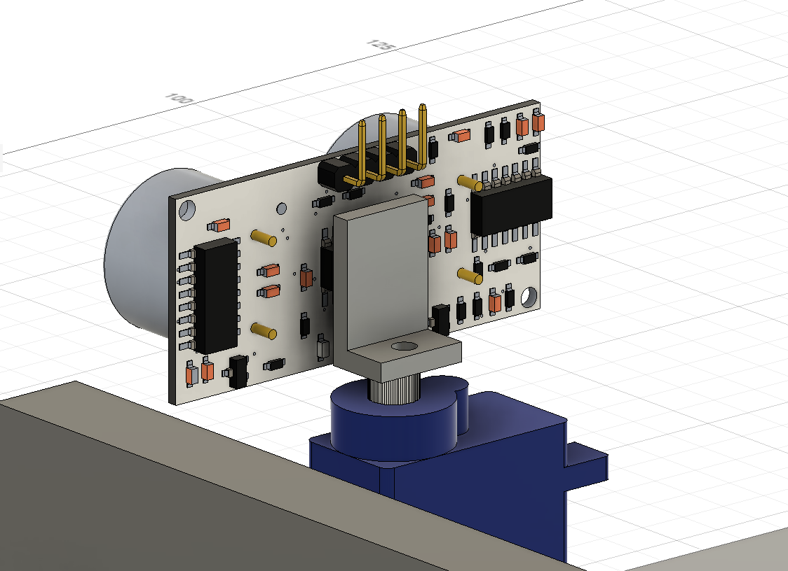

Okay, so the mount might be a little too small... I will extrude the sides a bit.

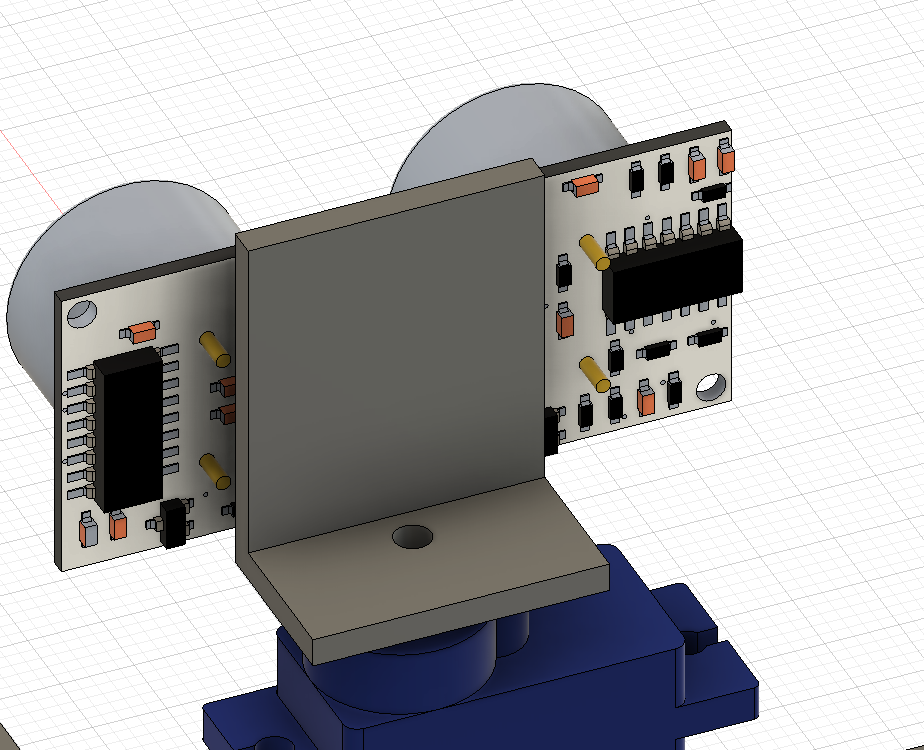

Better. So now that it's been mounted I realized that the sensor should be on the second floor instead of the first. I also have an option to make the clearance less by making the motor sit in a little caddy for the top roof. It will be easier to show than tell.   
To make this caddy for the servo, I will first take the dimensions of the servo motor (33x30x12) and add 5mm to all dimensions (38x35x17) because I intend to cut into this shape with 5mm walls on the sides. Actually walls will be 2.5 mm thick if I do this, and 5mm thick on the bottom. Hmm... Hm.... So dimensions shoulddd be 38x40x22 (assuming 38 is the height).

After looking at the servo image again, I noticed this:  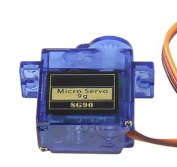

There's already two mounting holes on the sides of this, which would make a caddy not needed. But how do I tell the dimensions, because they don't have an image? They have a manual, let's look at that. Nvm, the manual is literally a manual that says peel off film before use. Not helpful for measurements. OKAY FOUND IT IN THE DESCRIPTION: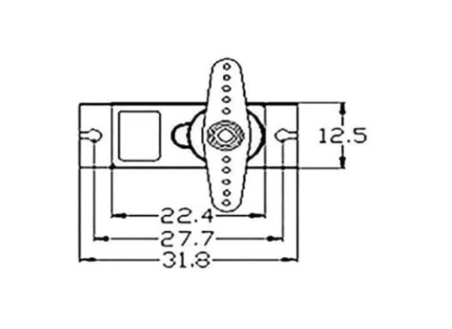

So the holes are basically 27.7 mm apart. How big are the holes. Actually I won't even need to make holes because screwing it won't be necessary. I can just cut out 22.4 x 12.5mm cutout (adding 0.4mm results in 22.8 x 12.9mm).

Alright so I cut that hole into the top chassis of the rover. The servo should just slide in and be propped up by its little arms sticking out.

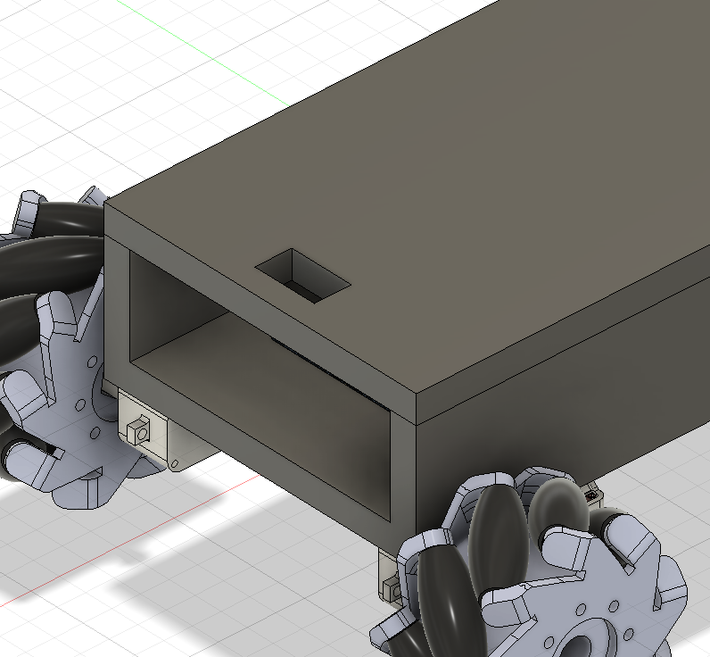

Like so.

Also, I don't like how the hole in the mount is too close to the wall.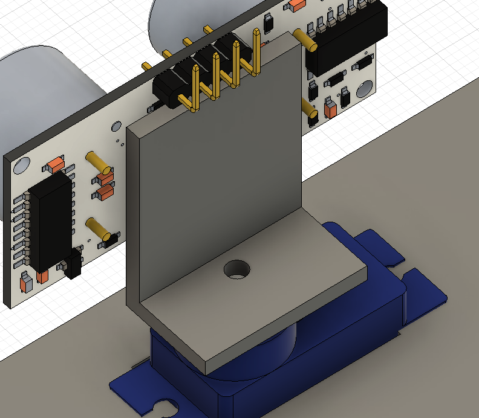

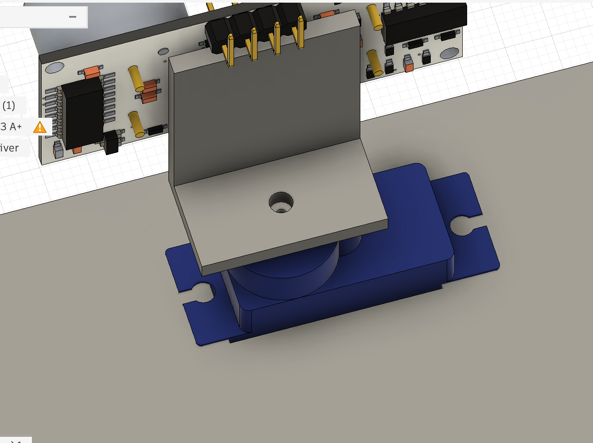

Better. So what's next... Ah I'll make holes to mount the lid to the chassis.

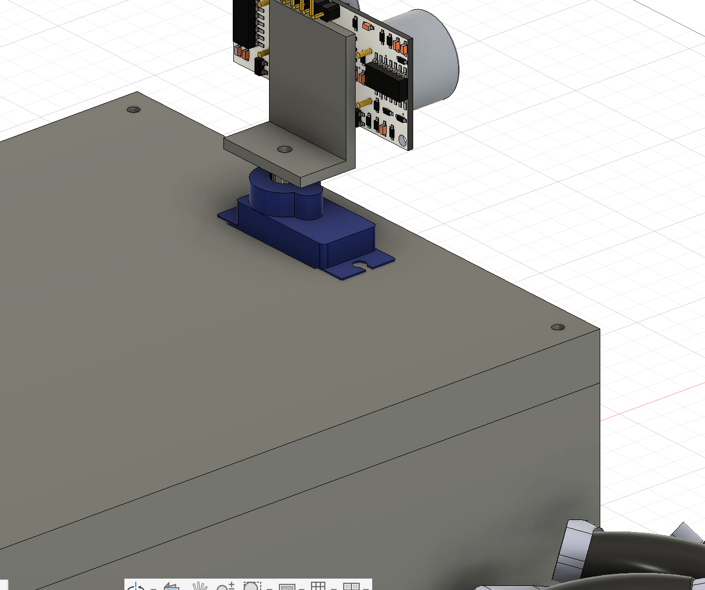

Okay so I made 4 holes that cut through everything (55mm so far, but I have a feeling I'll reduce the height of the lower part fo the chassis. The holes are 2.2 mm thick and space 5mm away from walls because the diameter of the walls is 10mm.

Now for the mop mechanism!! So the mophead should be at least 6 inches in diameter. How big would that look on the machine? 152.4 mm

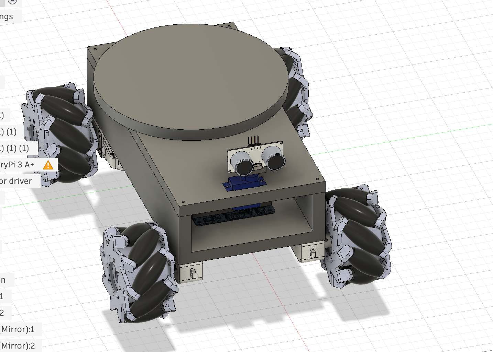

Okay so that's about this. Not bad. Now let me see standard mini mophead/scrubber sizes on aliexpress. Cool, so the circular polishing pads that car detailers use would work. [https://www.aliexpress.us/item/3256809381878672.html](https://www.aliexpress.us/item/3256809381878672.html)

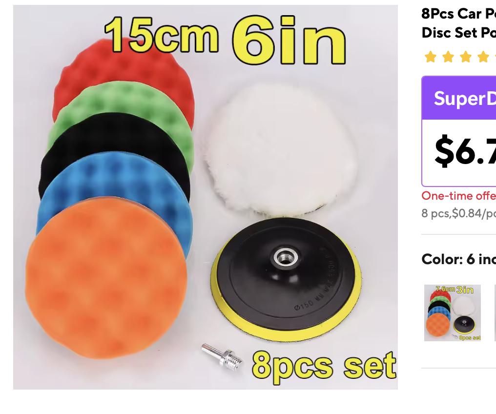

It looks like this and I think I can get this mounted on the dc motor. Let me find a dc motor that works for this, and see how to connect them from there.

Hmm.. I will leave this for tomorrow. I actually am going to add the camera module now, forgot about that!

[https://www.aliexpress.us/item/2251832482194239.html](https://www.aliexpress.us/item/2251832482194239.html) is a good one (color I 130). I found a 3d model too [https://grabcad.com/library/raspberry-pi-5mp-camera-module-1](https://grabcad.com/library/raspberry-pi-5mp-camera-module-1).

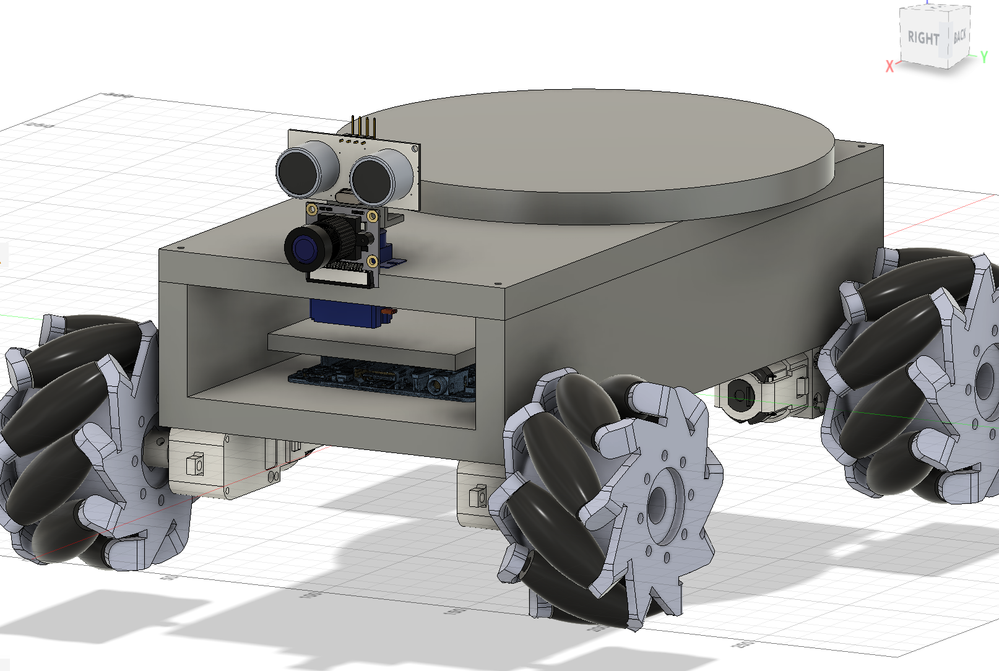

This is it for now but I will make a mount for that too I guess. Also I need to rethink the floor cleaning mechanism, because the stow away design would be difficult to implement and would require heavy motors.
