Okay, so day 6. This is where the project is going to take a bit of a turn. I've been thinking about the design of this, and I came to the conclusion that I either fully commit to the mop mechanism (in which case I would need to use a 360 LiDAR sensor with ROS2) or commit to just a driving rover (a classic beginner project). Realizing that I am a beginner, I decided to remove the mop mechanism and instead focus on making the rover for driving around. However, I don't just want to copy the classic obstacle avoiding car (which uses the ultrasonic sensor on top of servo). Instead, I discovered something called an AI camera ($35 from HuskyLens) that is beginner friendly, and allows the robot to track and follow objects. This would be way more fun, and I plan to pair this with a single point lidar sensor on a servo (instead of ultrasound, and only because lidar seems cooler) as a sort of something to make the robot avoid hitting a wall in case it gets confused with the camera.

So fBOM update:

1. 4 80mm mecanum wheels - [https://www.aliexpress.us/item/3256804929248374.html](https://www.aliexpress.us/item/3256804929248374.html)
2. 4 1:220 TT Motors - [https://www.aliexpress.us/item/3256808093084021.html](https://www.aliexpress.us/item/3256808093084021.html)
3. TOF sensor - [https://www.aliexpress.us/item/3256804940742766.html](https://www.aliexpress.us/item/3256804940742766.html)
4. Raspberry Pi 3 Model A+ - [https://www.adafruit.com/product/4027](https://www.adafruit.com/product/4027)
5. DF Robot Motor Driver Expansion Board - [https://www.aliexpress.us/item/3256807075492551.html](https://www.aliexpress.us/item/3256807075492551.html) or [https://www.dfrobot.com/product-2851.html](https://www.dfrobot.com/product-2851.html)
6. 12 mm M2.5 standoffs (spacers) + M2.5 screws
7. Wide-lens camera module - [https://www.aliexpress.us/item/2251832482194239.html](https://www.aliexpress.us/item/2251832482194239.html) (color I 130)
8. SG90 servo motor (for lidar sensor) - [https://www.aliexpress.us/item/3256806097043668.html](https://www.aliexpress.us/item/3256806097043668.html)
9. 2x 18650 2000mah 3.7v batteries - [https://www.aliexpress.us/item/3256808975352962.html](https://www.aliexpress.us/item/3256808975352962.html)
10. 2x18650 Battery Storage Box 7.4V - [https://www.aliexpress.us/item/3256811664143308.html](https://www.aliexpress.us/item/3256811664143308.html)

I removed most of the components associated with the mophead, as well as the outdated camera. I'm going to first confirm that the HuskyLens would be best for this project. It seems good, and I will be using the HuskeyLens 1 which is $34.90 ([https://www.dfrobot.com/product-1922.html](https://www.dfrobot.com/product-1922.html)). I will see if they have it on their AliExpress store and compare the cost. They only have the 2 version, and it's overpriced.

I think the more cost efficient approach would be to use the processing power of the Raspberry Pi to run object tracking through python using the same widelens camera, since the Huskylens doesn't allow for FOV streaming.

The single point lidar I'll be using is [https://www.aliexpress.us/item/3256804940742766.html](https://www.aliexpress.us/item/3256804940742766.html) which also is way smaller than a ultrasonic sensor, which is great.

Now time to reevaluate the battery, mecanum wheels, and driver board. Okay, the board seems fine. so for the battery, I am going to switch to something a lot more compact, which would be two 18650 2000mah batteries**.**

Link: [https://www.aliexpress.us/item/3256808975352962.html](https://www.aliexpress.us/item/3256808975352962.html)

To connect the batteries, I found this:[https://www.aliexpress.us/item/3256811664143308.html](https://www.aliexpress.us/item/3256811664143308.html)

It will plug in directly to the motor driver.

Finally, when moving away from HuskyLens (which processes video on its own board), I have to consider that the Raspberry Pi 3a+ will now be processing everything itself. I don't know if it has enough compute power for that, so I will check this out. It should work but the RAM is limiting, so I have to note to run the camera at a lower resolution and to run the script on it without using Raspberry Pi OS.

Now to update this in fusion:

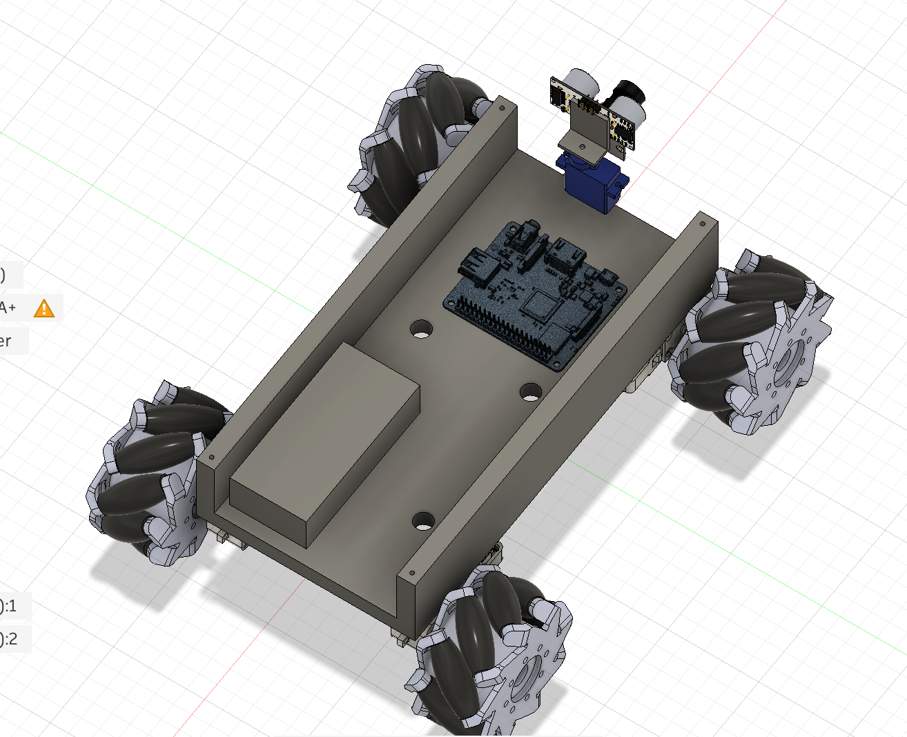

The new battery is way smaller, so a LOT of trimming is going to happen.

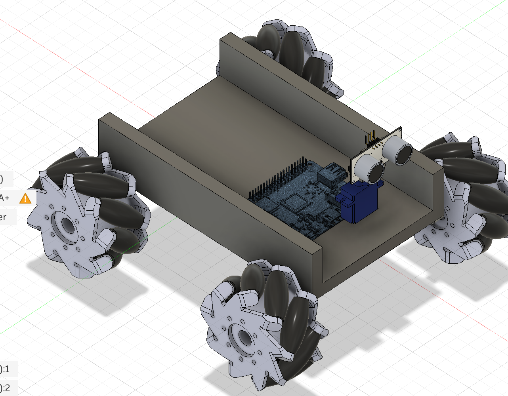

When I was cutting the chassis, I decided to fill in the holes by selecting one wall, extruding it the length of the chassis, and using the join operation. That accidentally joined my motors to the chassis too, so I had the hide the motors before doing this.

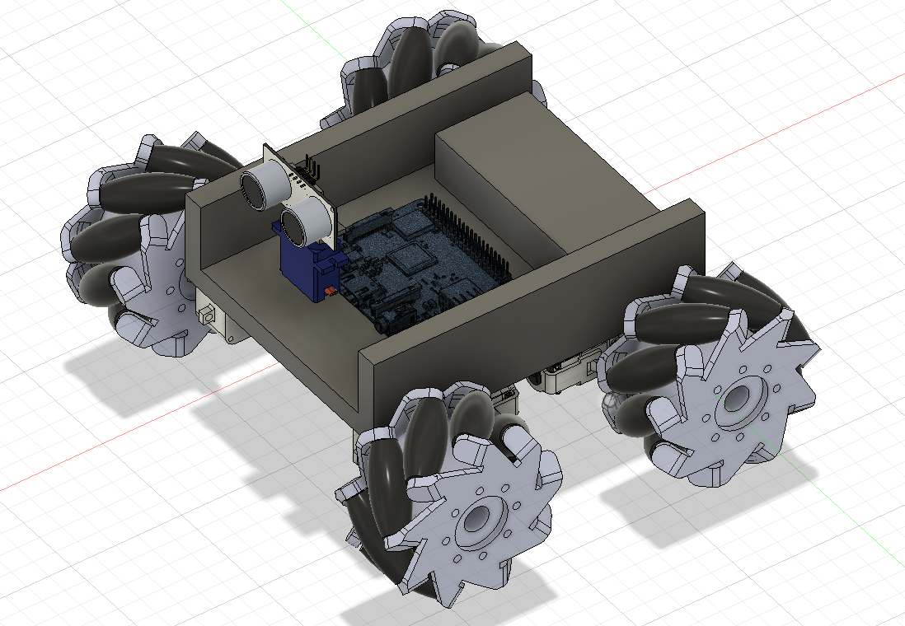

So compact! :) Now I will create a mount for the camera. I want camera to be on bottom floor while sensor can be on top (and fully unobstructed).

Let me get the dimensions of the camera. Dimension: 25mm x 24mm x 17mm. Hmmm... Hmmm... How far apart are the holes?

This is what it look slike btw, I might have to just guess.

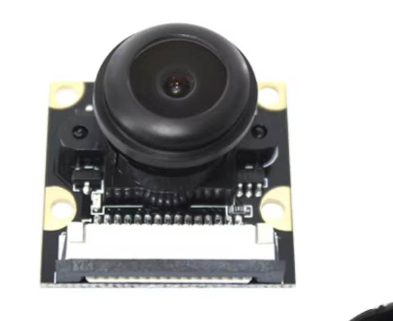

LOL NVM, this has everything!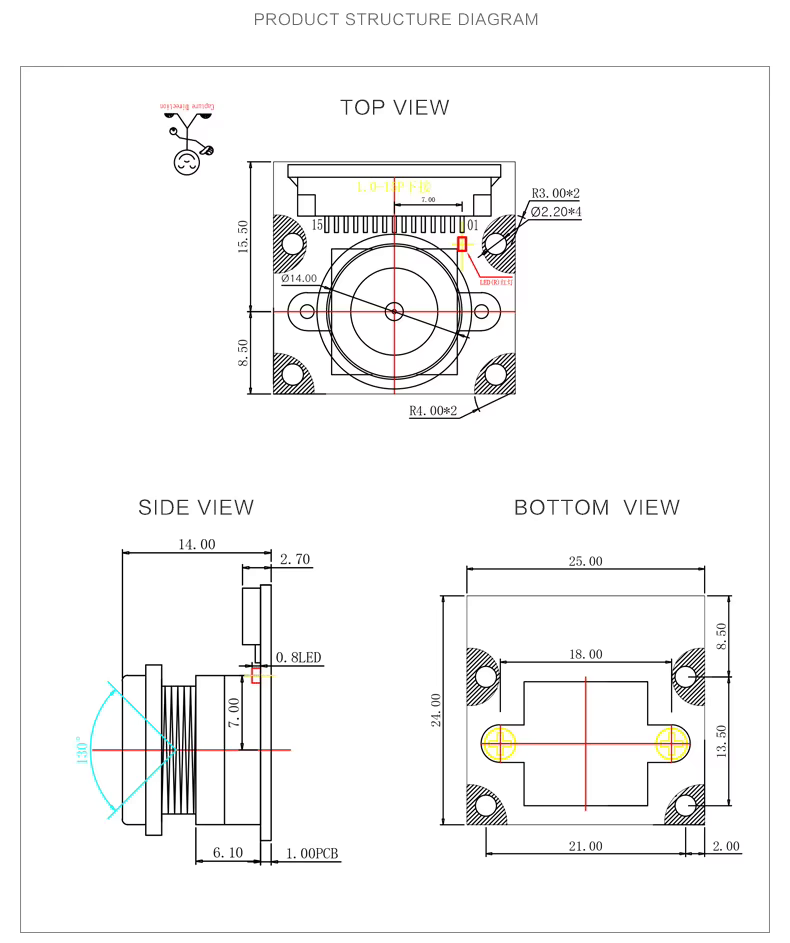

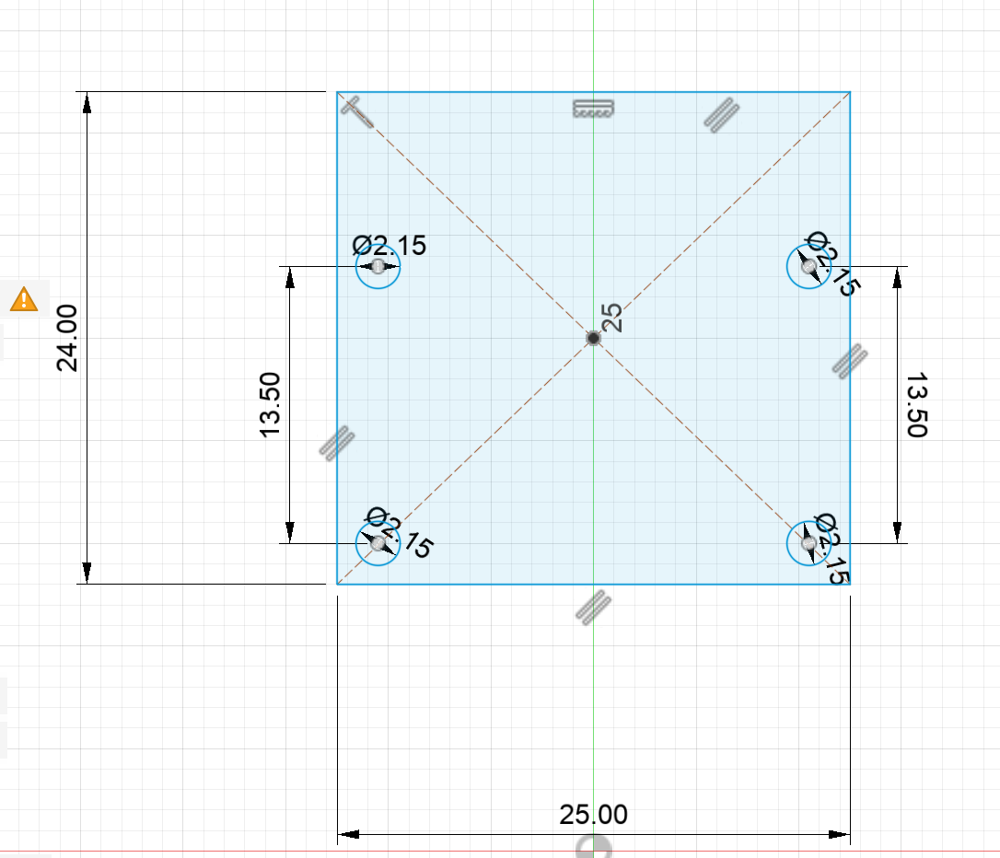

I think this is correct? Yep looks like it. I made the holes a little smaller than 2.20 mm so that the screws can bite into the plastic. Time to make it come to life.

Wowza! 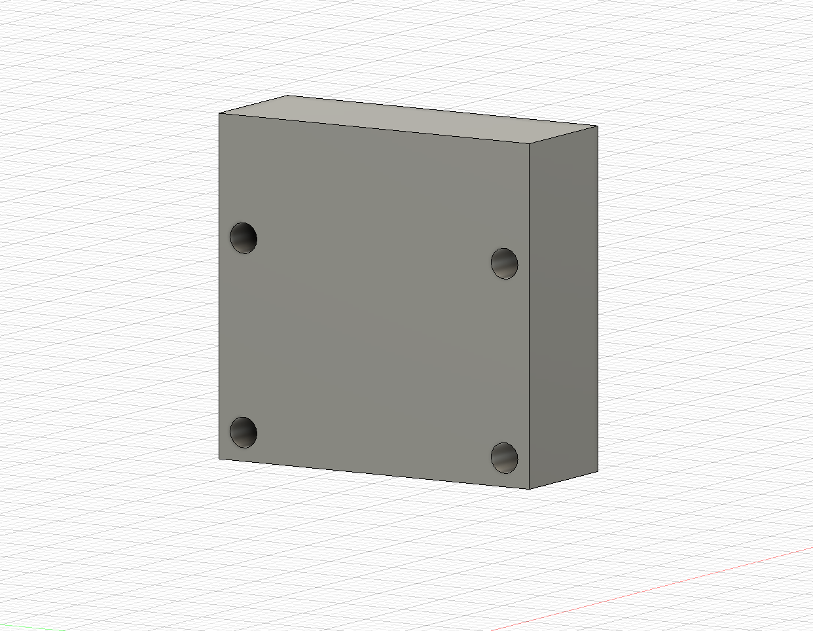

I was going to merge it into the bottom chassis, but then I realized that printing in that orientation would mess up the holes. So now I have to make ANOTHER hole in the bottom chassis to mount this to it.

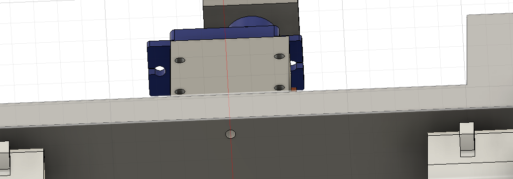

Okay, so see that small hole at the bottom? That's the mounting hole. Wait. Oop, it should be 2 holes, otherwise the mount can turn around. Gotta fix that, Maybe will space them 10mm apart.

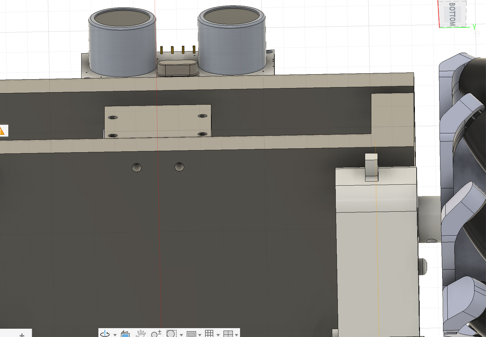Like so. Wow, I realized even if the camera mount is printed on its side to allow those four holes to be perfect, the bottom two holes for hooking it to the chassis will still be imperfect. Oh well. Yea, I will remove the bottom two holes entirely and just merge it to the chassis.

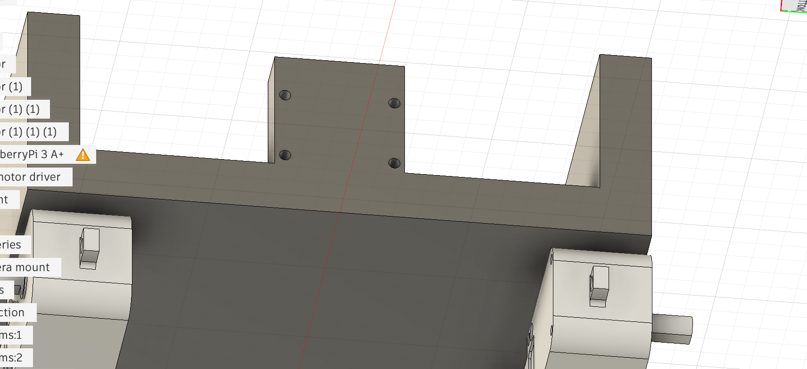

Okey that works I guess. I will learn more about mounting things in the future. I am going to extrude the side walls of that camera mount to make it more strong.

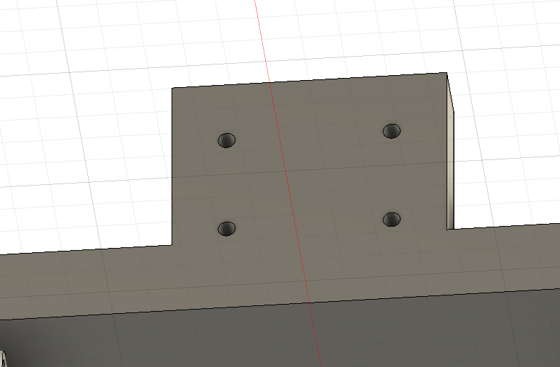

Cool.

Now, I will hook the camera to that, resize the lid to fit, and see what else needs to be done.

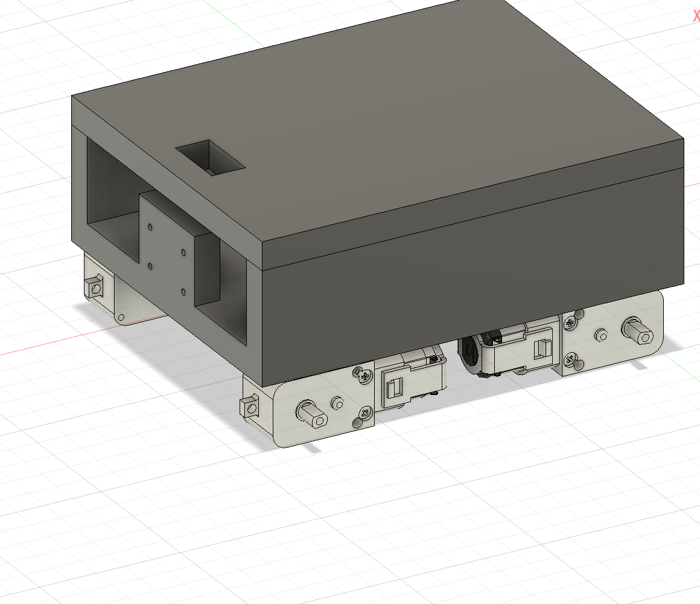

Okay so I jumped to the lid instead, I had to move the hole for the servo motor a little back so that the servo motor doesn't collide with the camera mount.

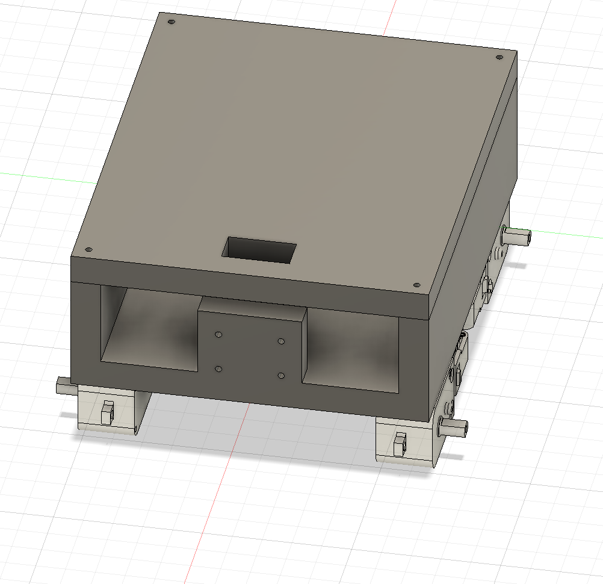

I recut holes to connect lid to chassis.

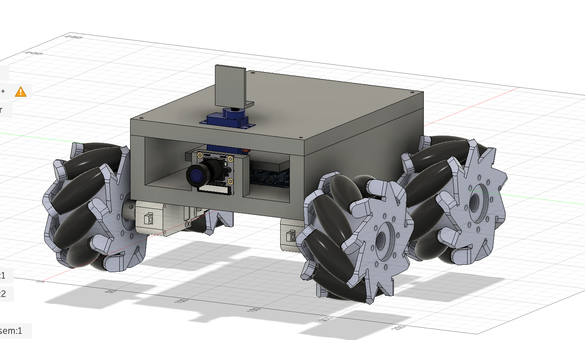

Camera has been mounted (kind of annoying that the model isn't the real camera, but it's a compromise), I will import the lidar now. I found [https://grabcad.com/library/vl53l0-1xv2-flight-time-tof-laser-ranging-distance-sensor-1](https://grabcad.com/library/vl53l0-1xv2-flight-time-tof-laser-ranging-distance-sensor-1)

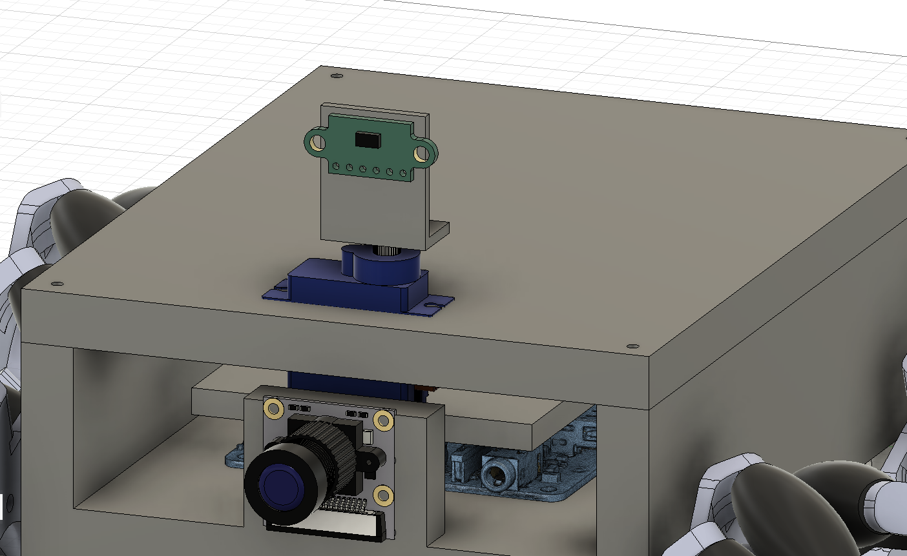

So the mount for lidar is a bit off in size now. Let me first verify that it is indeed the correct dimensions. It seems to be 25 x 13 irl. Comparing that to the cad version, it's off. I'll model based off the cad version, it can't be that far off.

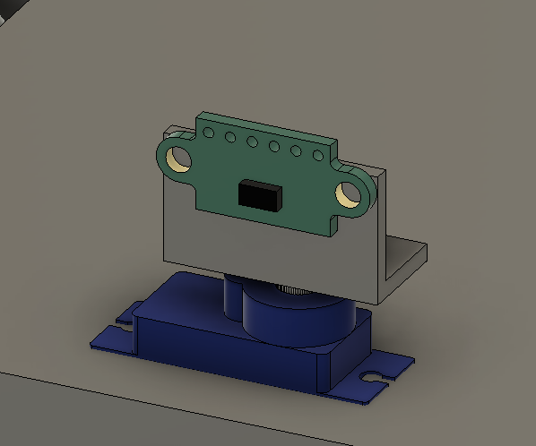

This is better, I have the pin holes sticking out so that it can be wired without the mount interfering.

Okay, I am exhausted. Basically tomorrow I need to make holes for the lidar wires to thread through the lid and into the chassis, then screw holes for the stepper motor to be fully fastened, and an idea I had to make the front of the robot clean (basically adding a face to cover everything except camera hole, although it does seem unnecessary because the lidar is so exposed anyways).

Is that it after? I will round corners of chassis for visual appeal. Yeah wow that's it. I will attach the other stuff with double sided electric tape, but other than that, the CAD will be done. Next will be wiring diagrams and all. Awesome!
