Alright so today I thought a lot about the robot again, and I have a lot of ideas for the visual body fo the chassis. I'm thinking of a 6 panel layout for the chassis, and aesthetic patterns cut into the panels to make the robot look premium. I also was thinking of a way to hide the motors. I also am thinking to put brass inserts into the screw holes to make it fully professional.

First I want to finalize what the sensor will be used for and also if I can incorporate solar panels on the top (because that'll look cool).

For the robot, I want to finalize three operating modes:

1. Manual mode - I control the robot using my phone and I can see live footage from the camera at around 720p.
2. Tracking mode - The robot runs OpenCV and camera at low res to track objects, sensor is only used to confirm the robot won't hit.
3. Wander mode - The robots relies on the sensor to wander around. not running OpenCV.

With that in place, I will proceed to fully ovveride the chassis.

But first I want to keep tabs on needed holes:

- Bottom panel hole for motors wires to go into board.
- Top panel holes for sensor wires to go into board.
- Holes to connect panels together
- Holes for the camera mount
- Holes for the servo motor mount
- Holes for raspberry pi mount
- Holes for battery holder mount
- {Later add-on - screw holes for motors to attach to the case}

And for new parts:

- Sensor cover
- Front back panels
- Updated Camera mount

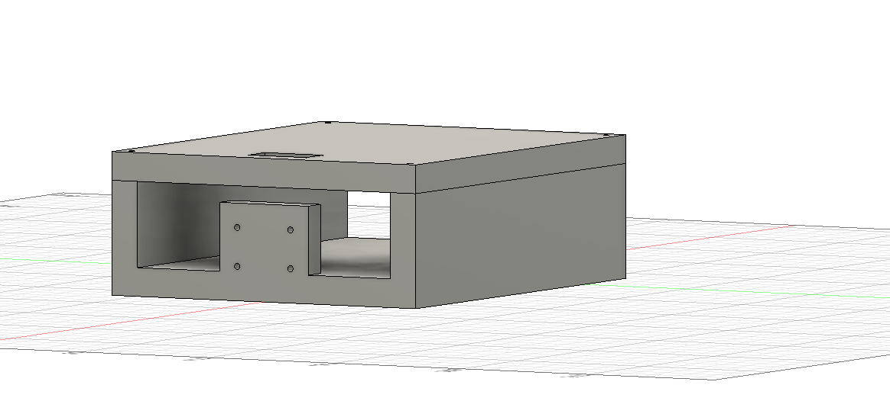

I isolated the chassis and lid and will start operating on it to update it.

I'm going to remove all holes from the lid and cut the chassis into 4 pieces.

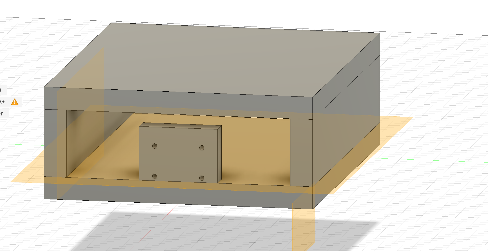

It's been cut.

Now I'm going to size it like so

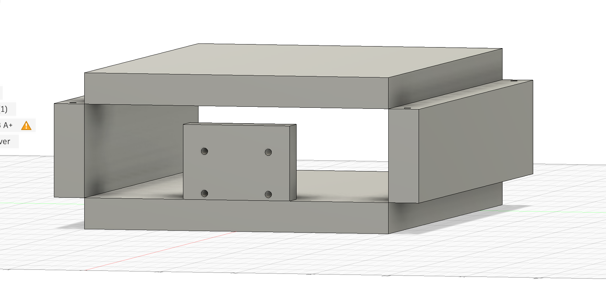

I made the side panels taller and thinner:

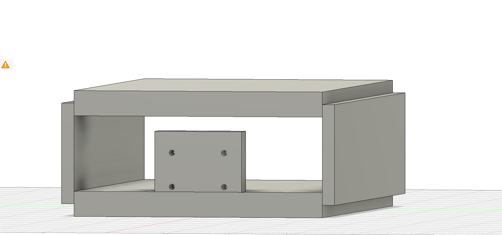

I then hide the side walls and started operating on the top and bottom panels:

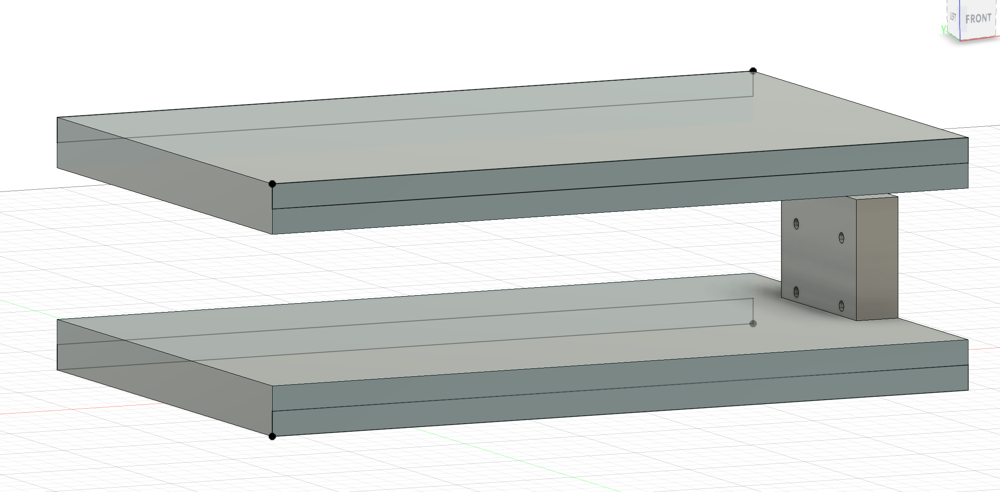

I extruded those rectangles 5mm , do you get what's going on now... (I imagined this design in my head). Now to do it for front and back 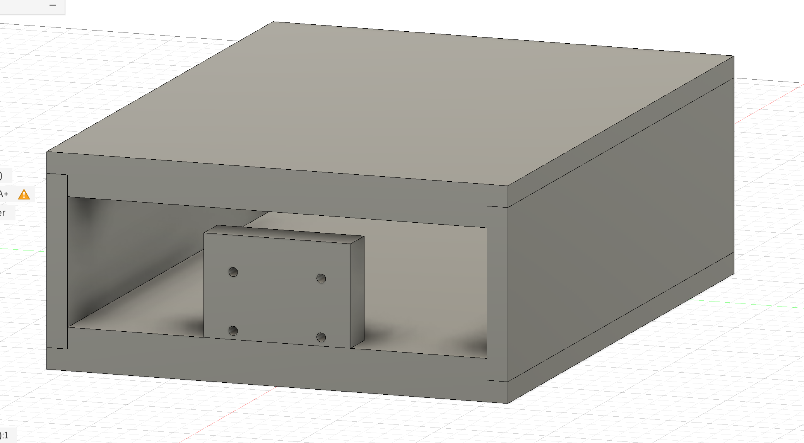

So I again drew rectangles splitting the front and back faces of the top and bottom panels in half, and then extruded 5mm:

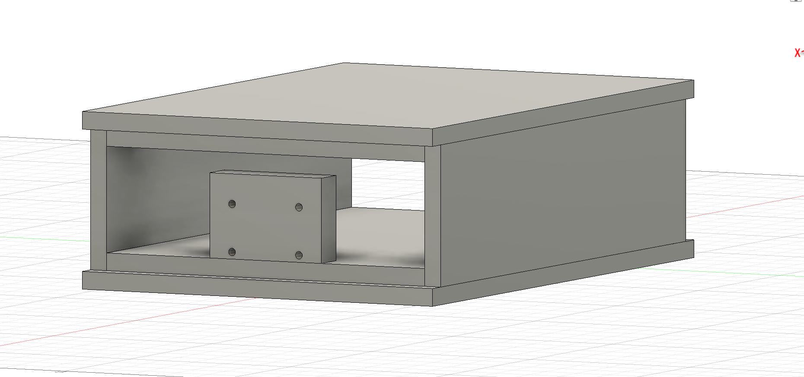

Now I'm going to bevel it off to give the industrial look, that's the reason I did this to the panels, because I can't put screw holes into the beveled part. It's actually called chamfer.  I did a 5mm chamfer which creates this stunnning look:

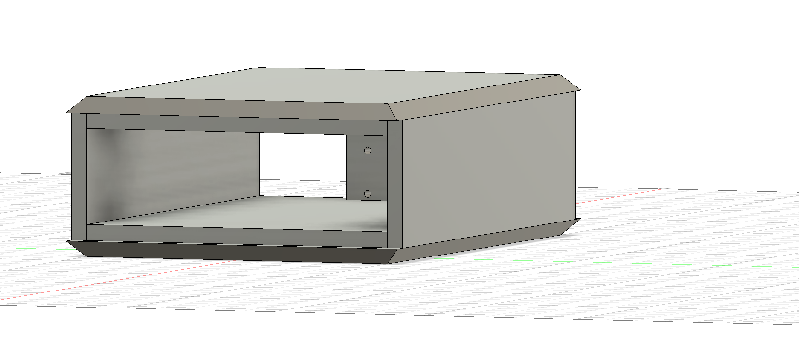Exactly as I imagined! Now I will add new front and back panels. The adjustments left the inside area the exact same, so there's no problem with moving the interior components around again.

There we go

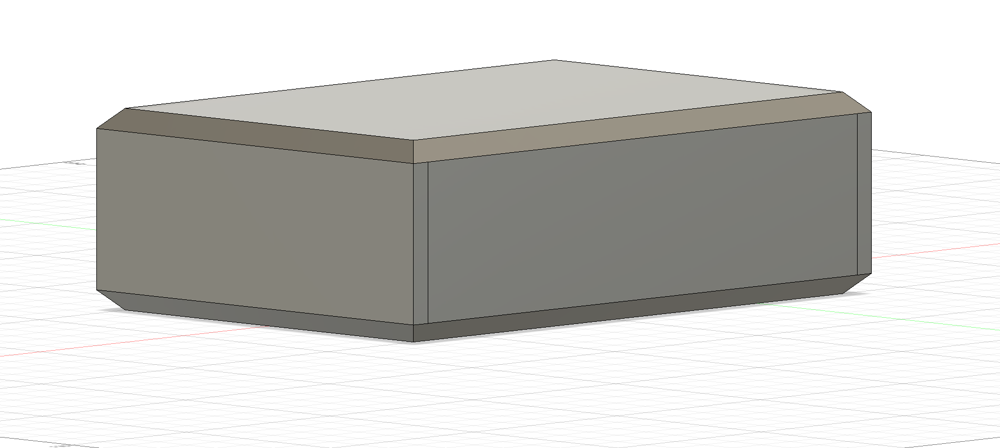Now I have to do something I've been meaning to do, show all the componets and rotate everything so that the front of this aligns with Front in fusion 360 lol. (I've been putting it off)

Holy it is not working. All components are going crazy. After troubleshooting, I realized I have to group them first, and then rotate them all. Then I can ungroup later. No it still doesn't work. I tried to parent everything too and that also doesn't work. I guess we'll leave that alone.

I'm just going to go into creating screw holes for the panels. I will assume the standard size M3 Heatset insert. I found [https://www.aliexpress.us/item/3256806286648221.html](https://www.aliexpress.us/item/3256806286648221.html) which gives M3 inserts in lengths of various lengths. For screws I found [https://www.aliexpress.us/item/3256807092650644.html](https://www.aliexpress.us/item/3256807092650644.html) which gives M3 screws in various lengths. I'll go with 4mm in length for the insert for these panels at least. So for M4 4mm 4.2 outer radius, I'll make a hole of 5mm deep, 3.9mm in diameter, and a 0.5 mm 45 degree chamfer. I'll make the outer panel have a 3.4 mm hole.

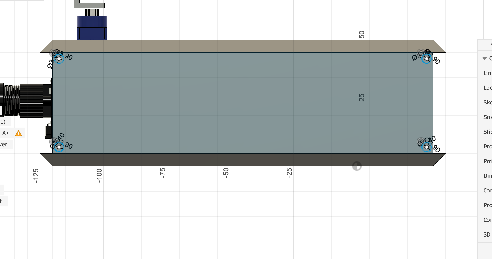

Drew the holes. I then cut the right panel and the top and bottom panels. The holes are way too big for brass inserts. I could either go down to M2.5 brass inserts and screws, or ditch the brass inserts and go down to M2.5.

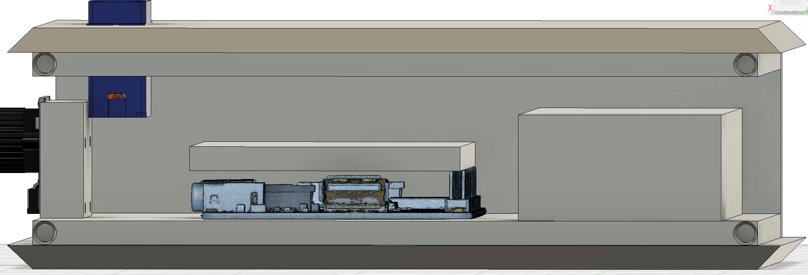

So I found M2.5 screws [https://www.aliexpress.us/item/3256805499526173.html](https://www.aliexpress.us/item/3256805499526173.html) . They come in different lengths in both M2 and M2.5.

I think I'll ditch the brass inserts for simplicity, because the walls are thin enough anyways. I won't need to unscrew enough. Before I insert screw holes I want to further improve the interior model. So three things:

1. I am going to incorporate the camera mount into the front panel
2. I will lower the servo into the roof to make it hidden except for the protruding part
3. I will need to slice the top panel into 2 parts, the front part (servo motor part) will be screwed while the back one will have magnets for easy open and close to access batteries (almost forgot about that, imagine having to unscrew it every time I want to recharge it.)

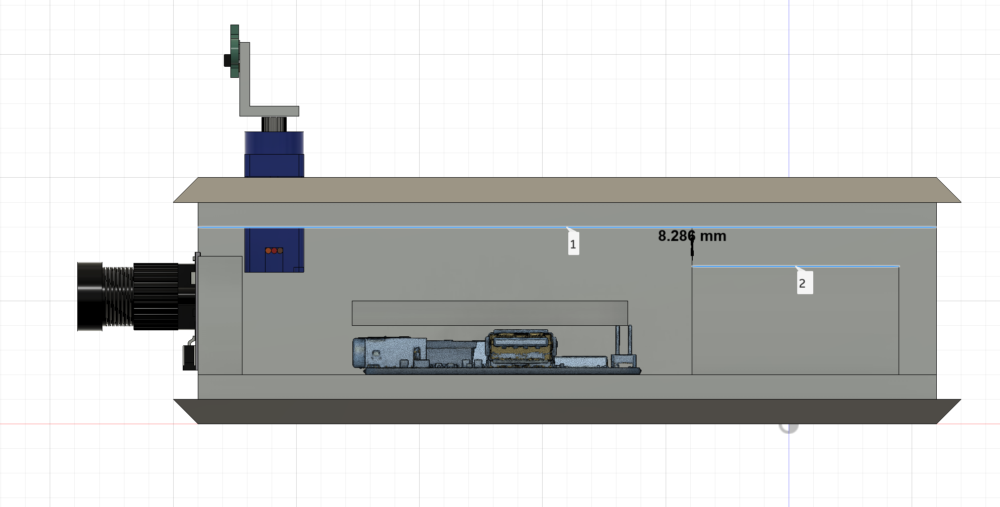

First I will lower the roof by 5mm because as you can see, there's more than enough clearance between the battery and roof. To do this I just need to decrease the height of all 4 side panels by 5mm.

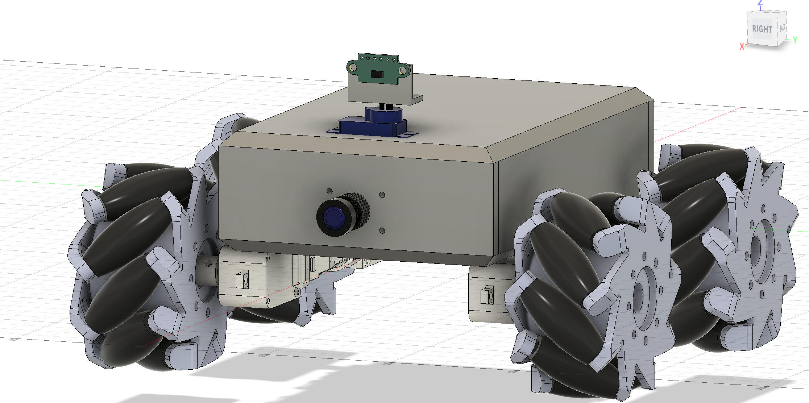

After that I incorporated the camera mount into front panel.

Before lowering servo I want to take another look at its dimensions.

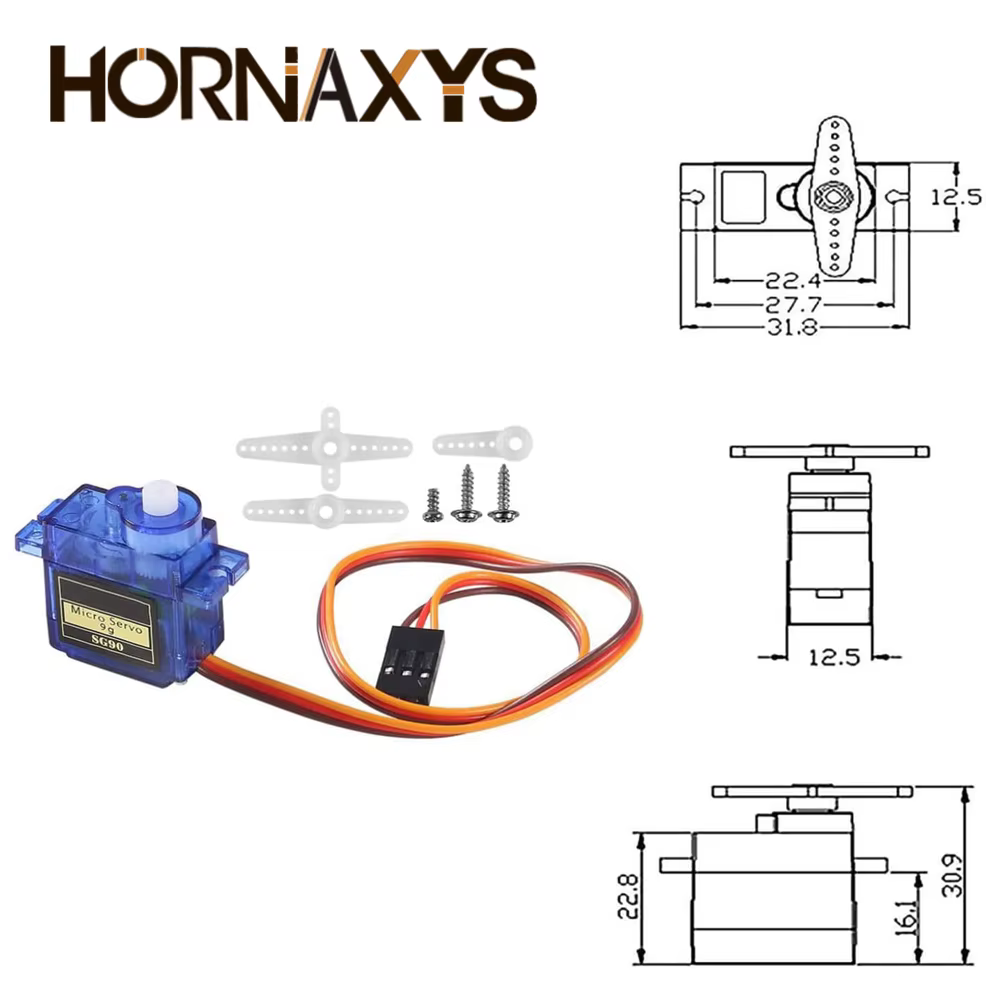

So first I'll create a hole of 22.8 x 12.9 that goes through the whole top panel. Then I'll create a 6.7mm thick hole of 32.2 x 12.9 for the arms to hide.

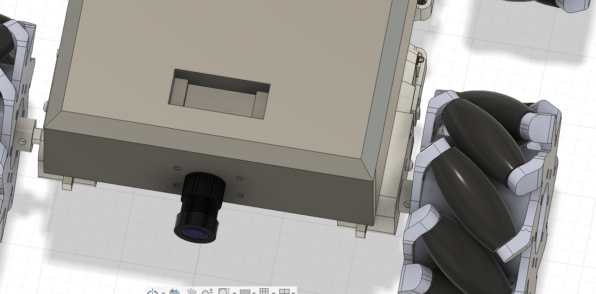

Like so.  
Now I will split the front panel in 2. Done. Basically I will add magnet holes and a crevice in this panel to allow it to be detached easily. The only thing now is that the left and right panels cannot be screwed to this piece, otherwise it will obviously be stuck.

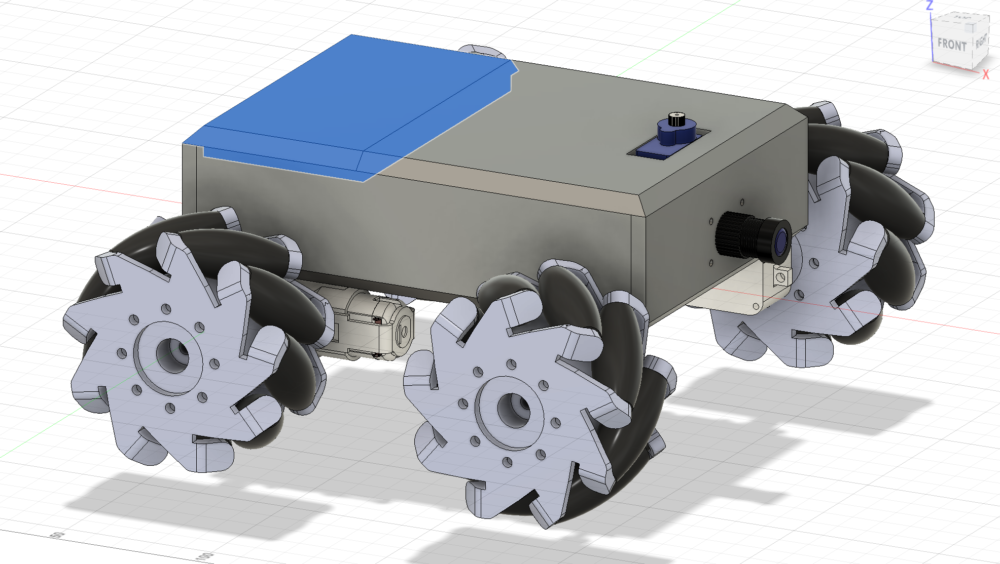

Now, things for tomorrow. (I won't do solar panel btw because of this removable panel). First I will bring back the ultrasonic sensor because it looks cooler. Then I will design a mini case around it so that it's not exposed pcb. Then I'll add all the screw holes (boo) as well as screw holes for motors. Then verifying measurements and finally it's a matter of adding more design details. This is going to look really cool.
